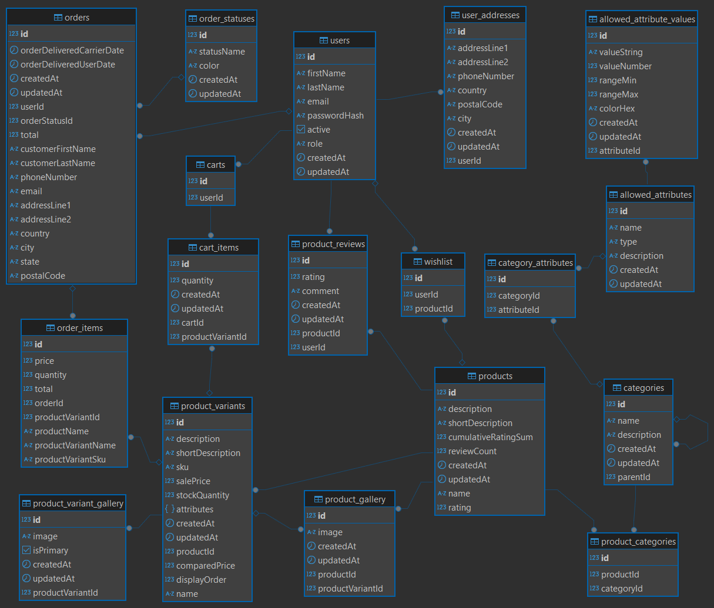

## Description

This is the backend for an e-commerce platform. It is built using TypeScript, Nest.js, TypeORM, PostgreSQL, Stripe, and Docker.
The project currently in development - about 80% of the functionality is implemented.

## Quick Start

**1. Install `pnpm` Package Manager**

```bash
npm install -g pnpm@latest-10
```

**2. Clone the Repository**

```bash
git clone https://github.com/AndriyCh1/shop-backend
```

**3. Install Dependencies**

Navigate to the project directory and install the dependencies using pnpm:

```bash
cd shop-backend
pnpm i
```

**4. Configure `.env` File**

Create a `.env` file and fill in the values described in `.env.example`.

**5. Start the Development Server**

```bash
pnpm run start:dev
```

## Modules

- **Auth** – Handles user authentication and authorization.
- **Users** – Manages user accounts.
- **Products** – Manages product data, including variants and catalog.
- **Cart** – Handles user shopping carts.
- **Orders** – Processes and manages user orders.
- **Payments** – Handles payment processing.
- **Reviews** – Manages product reviews and ratings.
- **Categories** – Organizes products into categories.
- **Wishlist** – Manages user wishlists.

## Database



## Authorization

### Define Policies

```ts
export class UserPolicy extends UserBasedPolicy {
  name = 'User';

  defineRules({ can, cannot }: RuleAdder, user: UserContext): void {
    if (user.role === UserRole.ADMIN) {
      can(Action.Manage); // Only admin can manage users
    } else {
      can(Action.Read, { id: user.id }); // Only user can read their own profile
      can(Action.Update, { id: user.id }); // Only user can update their own profile
      cannot(Action.Delete); // In this example, only admin can delete users
    }
  }
}
```

### Define Abilities

```ts
export class UserAbilityFactory extends BaseAbility<UserContext> {
  constructor(user: UserContext) {
    super(user);
  }

  public withUserPolicy() {
    return this.applyPolicy(userPolicy);
  }

  public withPostPolicy() {
    return this.applyPolicy(postPolicy);
  }
}
```

### In action

```ts
  async updateUser(
    id: number,
    payload: UpdateUserData,
    executor: Pick<User, 'id' | 'role'>,
  ): Promise<User> {
    const abilityForUser = new UserAbilityFactory(executor);
    const userPolicyAbility = abilityForUser.withUserPolicy();

    if (userPolicyAbility.cannot(Action.Update, { id })) {
      throw new PermissionDeniedException();
    };

    // Now we can update the user
  }
```
